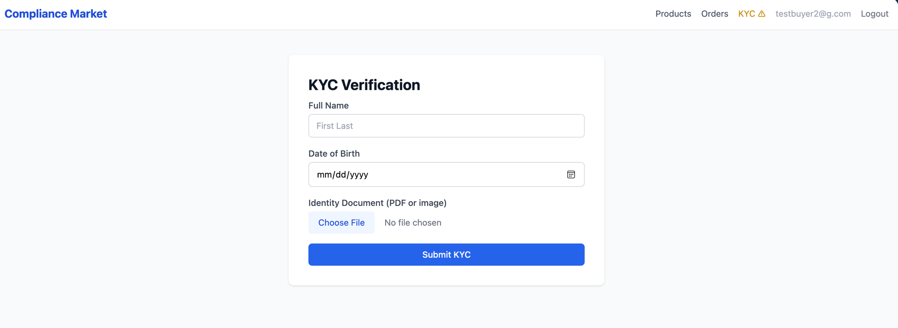
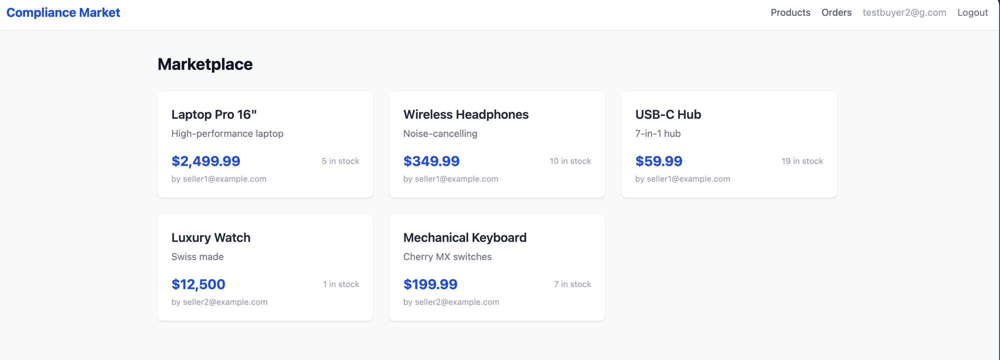
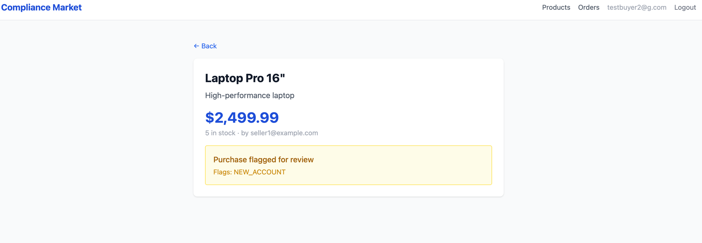
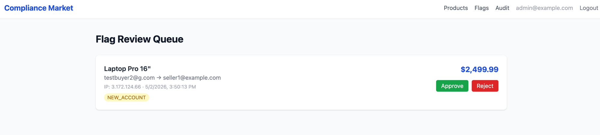
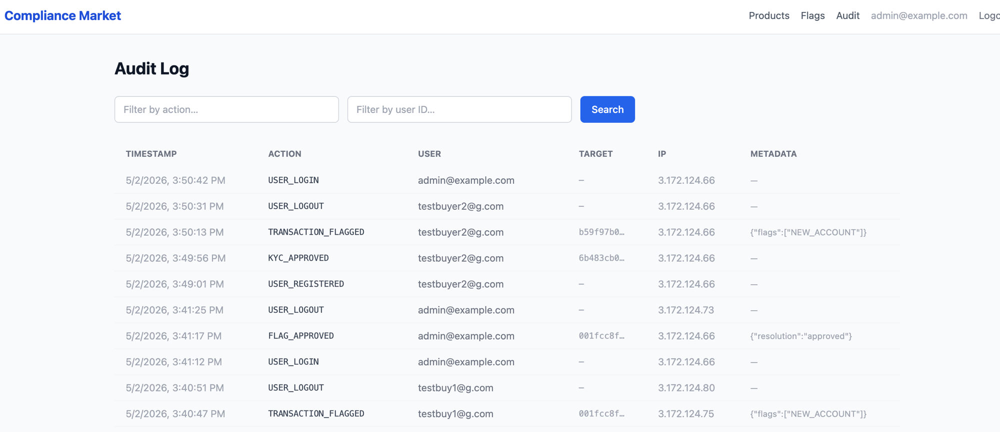

# Compliance-Aware Marketplace

A full-stack e-commerce platform built with MERN stack and deployed on AWS, featuring dual-role accounts (Buyer/Seller), KYC verification, transaction flagging, and a compliance audit trail.

## Why This Exists

Standard marketplaces let anyone transact freely. This platform enforces compliance rules before any transaction can occur — users must pass KYC verification, transactions are evaluated against rule-based fraud checks, and every state-changing action is logged immutably for audit purposes. Inspired by real-world compliance workflows in financial services.

## Tech Stack

| Layer | Technology |
|---|---|
| Frontend | React (Vite), TailwindCSS |
| Backend | Node.js, Express.js |
| Auth | JWT, bcrypt, Role-Based Access Control |
| Database | PostgreSQL (AWS RDS) |
| File Storage | AWS S3 (KYC document uploads) |
| Hosting | AWS EC2 (backend), AWS S3 + CloudFront (frontend) |
| Compliance | Rule-based KYC middleware, transaction flagging engine |

## Architecture Overview

```
[React Frontend] — CloudFront + S3
        |
        | HTTPS (REST API)
        |
[Express Backend] — EC2
        |
   _____|_____
  |           |
[RDS]       [S3]
PostgreSQL  KYC Docs
```

## Core Features

### Auth & Roles
- Three roles: `buyer`, `seller`, `admin`
- JWT-based session management
- Role-based route protection — sellers can list, buyers can purchase, admins can review

### KYC Verification (Mock/Rule-Based)
- Users submit name, DOB, and a document (stored in S3)
- Rule-based engine checks: name completeness, age >= 18, document present
- KYC status: `pending` → `approved` / `rejected`
- Unverified users are blocked from transacting via middleware

### Transaction Flagging Engine
- Every transaction passes through a rule engine before completion
- Flag rules (configurable in `/server/config/flagRules.js`):
  - Transaction amount > $10,000
  - More than 5 transactions in 10 minutes from same user
  - Buyer and seller share the same IP
  - First transaction within 1 hour of account creation
- Flagged transactions go to admin review queue, not auto-rejected

### Audit Log
- Every state-changing action (login, KYC submission, transaction, flag, admin decision) is recorded
- Log entry: `{ userId, action, targetId, metadata, timestamp, ip }`
- Admin dashboard shows filterable audit trail
- Logs are append-only — no update/delete routes exist for this table

## Database Schema

See `/docs/schema.md` for full ERD and table definitions.

Tables: `users`, `kyc_records`, `products`, `transactions`, `transaction_flags`, `audit_logs`

## Project Structure

```
compliance-marketplace/
├── client/                  # React frontend
│   └── src/
│       ├── components/
│       │   ├── auth/        # Login, Register, ProtectedRoute
│       │   ├── kyc/         # KYC submission form, status banner
│       │   ├── products/    # Listing, detail, create product
│       │   ├── transactions/# Checkout, transaction history
│       │   └── admin/       # Flag review queue, audit log viewer
│       ├── pages/           # Route-level page components
│       ├── context/         # AuthContext, KYCContext
│       └── utils/           # API client, formatters
│
├── server/                  # Express backend
│   ├── routes/              # auth, users, products, transactions, admin, kyc
│   ├── controllers/         # Business logic per route group
│   ├── middleware/          # jwtAuth, requireKYC, requireRole, auditLogger
│   ├── models/              # DB query functions (no ORM — raw pg)
│   └── config/              # db.js, s3.js, flagRules.js
│
├── infra/                   # AWS setup
│   ├── ec2-setup.sh         # EC2 bootstrap script
│   ├── rds-setup.md         # RDS config steps
│   └── cloudfront-setup.md  # CloudFront + S3 static hosting steps
│
├── docs/
│   ├── schema.md            # Full DB schema + ERD description
│   ├── architecture.md      # System design decisions
│   └── flag-rules.md        # Compliance rule documentation
│
└── .env.example             # Required environment variables
```

## Getting Started

### Prerequisites
- Node.js 18+
- PostgreSQL (local or AWS RDS)
- AWS account (S3 bucket for KYC docs)

### Local Setup

```bash
# Clone
git clone https://github.com/RajLaskar10/compliance-marketplace.git
cd compliance-marketplace

# Backend
cd server
cp ../.env.example .env   # fill in your values
npm install
npm run dev

# Frontend
cd ../client
npm install
npm run dev
```

### Environment Variables

See `.env.example` for all required variables including:
- `JWT_SECRET`
- `DATABASE_URL` (RDS connection string)
- `AWS_S3_BUCKET` (KYC document storage)
- `AWS_ACCESS_KEY_ID` / `AWS_SECRET_ACCESS_KEY`

## AWS Deployment

See `/infra/` for step-by-step setup guides for EC2, RDS, S3, and CloudFront.

## Screenshots

### KYC Verification
Users submit their full name, date of birth, and a government ID document. The rule engine instantly approves or rejects the submission — no manual review required. Approved users receive an updated JWT so the KYC gate lifts immediately without a logout.



---

### Marketplace
KYC-verified buyers browse live product listings created by sellers. Each card shows the product name, price, and seller. Unverified users are blocked at the route level and redirected to the KYC flow.



---

### Transaction Flagging (NEW_ACCOUNT Rule)
When a buyer completes a purchase, every transaction passes through the flag engine. Here the `NEW_ACCOUNT` rule fires because the buyer's account is less than 1 hour old. The transaction is held in `flagged` status for admin review rather than auto-rejected — consistent with real compliance workflows.



---

### Admin Flag Review Queue
Admins see all flagged transactions in a paginated queue showing the triggered rule, buyer, amount, and timestamp. Each entry can be resolved as `completed` (approve) or `cancelled` (reject), which updates both the flag record and the transaction status in a single database transaction.



---

### Admin Audit Log
Every state-changing action — logins, KYC submissions, purchases, flag resolutions, and admin decisions — is recorded in an append-only audit log. The log is filterable by user and action type. No update or delete routes exist for this table.



---

## Compliance Design Decisions

See `/docs/architecture.md` for rationale behind the audit log design, KYC flow, and why transactions are flagged rather than auto-rejected.


